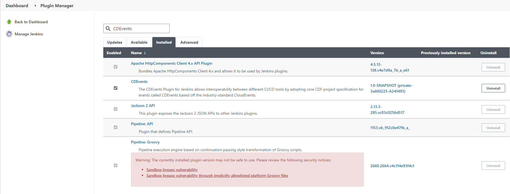
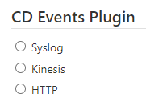

# CDEvents plugin for Jenkins

  

## Introduction

The [CDEvents](https://cdevents.dev/) Plugin for Jenkins allows interoperability between different CI/CD tools by
adopting core CDF project specification for events called CDEvents based off the industry-standard CloudEvents.

By using this plugin in your workflows, you can emit and consume CDEvents for various events in Jenkins relating to
Jenkins objects (jobs, projects, queues, stages etc). It will also provide a series of sinks that end users can
configure such as Http, Kinesis, SQS etc.

The standardization of events by adopting CDEvents will make it easier to interoperate systems without having to write
adapters.

## Installing and configuring the plugin

1. Install the CDEvents Plugin by going to **Manage Jenkins | Manage Plugins**.
   

   > **Note**  
   > For more information on installing plugins,
   see [Installing a plugin](https://www.jenkins.io/doc/book/managing/plugins/#installing-a-plugin)

2. Configure your CDEvents Sink Types **Manage Jenkins | Configure System**.  
   

### CDEvents Sink Types

|                                              | Sink Type | Description                                                                                                                                      |
|----------------------------------------------|-----------|--------------------------------------------------------------------------------------------------------------------------------------------------|
|    | Syslog    | Use `SysLog` when testing the plugin. The CDEvents will be written to the System Logger to view the events being captured by the plugin.         |
|  | Kinesis   | Use `Kinesis` to send the CDEvents to an [AWS Kinesis](https://aws.amazon.com/kinesis/) Data Stream to capture, process, and store the CDEvents. |
|        | HTTP      | Use `HTTP` to send the CDEvents to an HTTPEndpoint.                                                                                              |

## Changelog

* For recent versions, see [GitHub Releases](https://github.com/jenkinsci/cdevents-plugin/releases)

## Contributing

See [CONTRIBUTING.md](./CONTRIBUTING.md) for the contribution guidelines.

## License

* Plugin source and documentation - [Apache 2.0](https://opensource.org/license/apache-2-0/)
