# CDEvents plugin for Jenkins

  

## Introduction

The [CDEvents](https://cdevents.dev/) Plugin for Jenkins allows interoperability between different CI/CD tools by
adopting core CDF project specification for events called CDEvents based off the industry-standard CloudEvents.

By using this plugin in your workflows, you can emit and consume CDEvents for various events in Jenkins relating to
Jenkins objects (jobs, projects, queues, stages etc). It will also provide a series of sinks that end users can
configure such as Http, Kinesis, SQS etc.

The standardization of events by adopting CDEvents will make it easier to interoperate systems without having to write
adapters.

## Installing and configuring the plugin

1. In root of the project run the command "mvn compile hpi:run" in your terminal.
   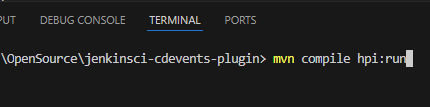

2. Open your browser and navigate to http://localhost:8080/jenkins.
   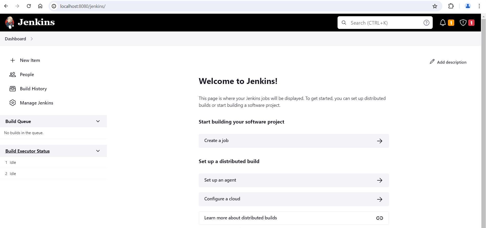

3. Go to "Manage Jenkins".

4. Click on "Plugins".

5. Click on "Advanced Settings".

6. Set the field 'Server' to the appropriate proxy. Ex. "http.proxy.myproxy.com".

7. Set the field 'Port' to "8000".
   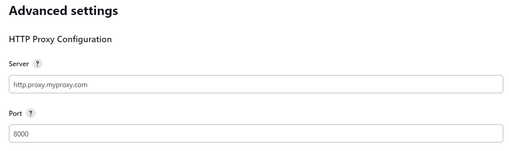

8. Select the 'Advanced' drop down setting in the 'HTTP Proxy Configuration' section.

9. Set the field 'Test URL' to "http://www.google.com".
   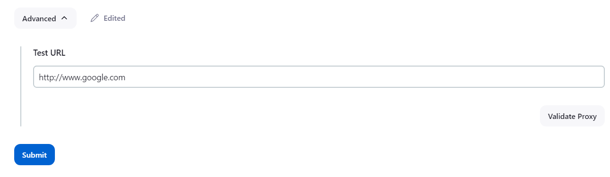

10. Select 'Validate Proxy'.

11. Select 'Submit'.

12. In the left hand selection pane select 'Available plugins'.

13. Wait for your console to display that a connection has been made. It should display a message stating something like "Performed the action check updates server successfully at the attempt #1". You may have to wait and refresh your browser page multiple times.
   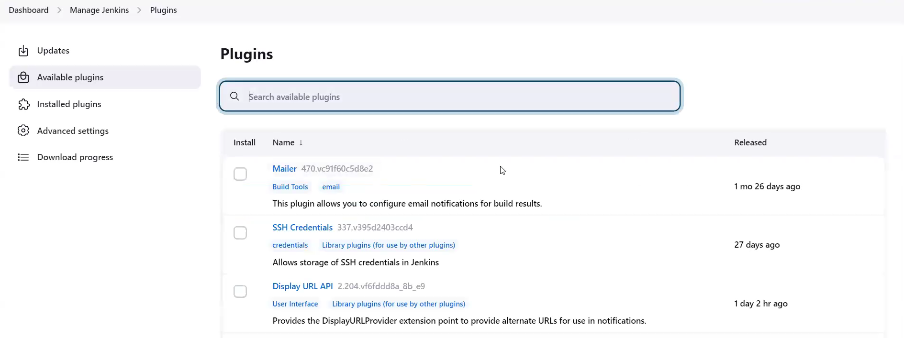

14. Return to the 'Available plugins' page and look for "pipeline" in the search bar.

15. Check the 'install' box for the first returned response. The descriptions should say something like "A suite of plugins that lets you orchestrate automation, simple or complex..."
   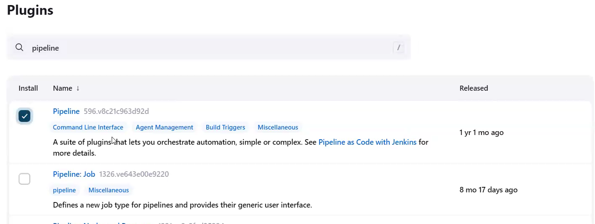

16. Select 'Download now and install after restart'.

17. Wait for the download to complete. All steps should report 'Downloaded Successfully'.
   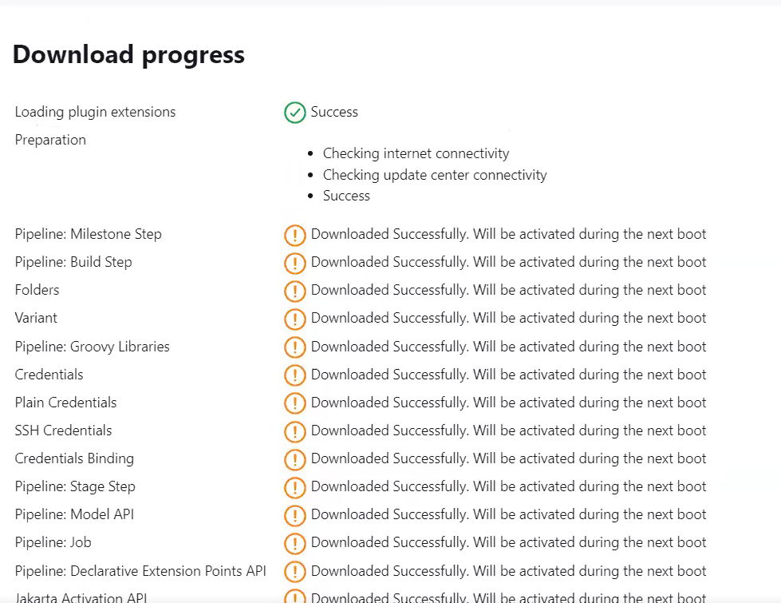

18. In your terminal restart your instance (ctrl+C).

19. Rerun the command "mvn compile hpi:run".

20. Return to Jenkins in your browser and select 'Dashboard' in the path listed at the top pane of the Jenkins window.

21. In the left hand selection pane select 'New Item'.

22. Give the item a name. Ex. "myFirstPipeline".

23. Select the 'Pipeline' option below- the search box.

24. Select 'OK'.
   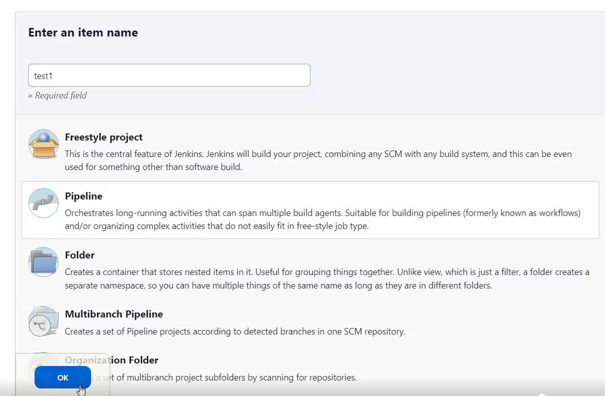

25. Scroll to the bottom of the page so that you are in the Pipeline section of the page.

26. In the dropdown option on the right hand side of the 'Script' pane under 'Pipeline' select 'Hello World'.
   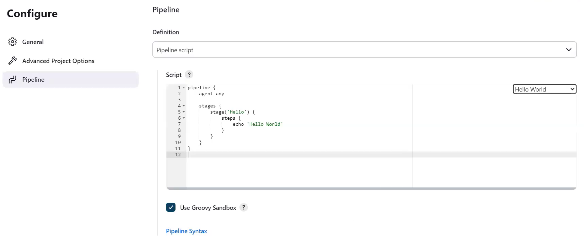

27. Select 'Save'.

28. Select 'Dashboard' in the path listed at the top pane of the Jenkins window.

29. In the left hand pane of the window select 'Manage Jenkins'.

30. Select 'System'.

31. Look for the 'CD Events Plugin' section of the page and select 'Syslog'.
   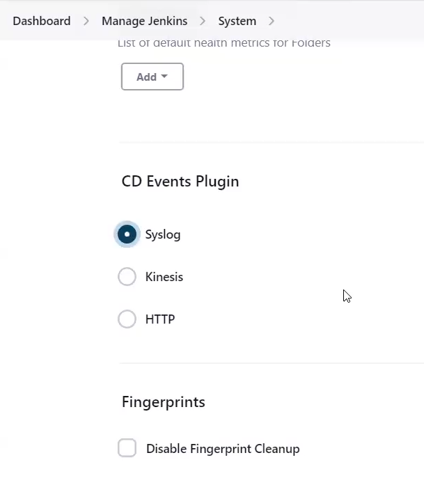

32. Select 'Save'.

33. In the left hand pane of the window select 'Build Now'.

34. Your pipeline should build successfully.
   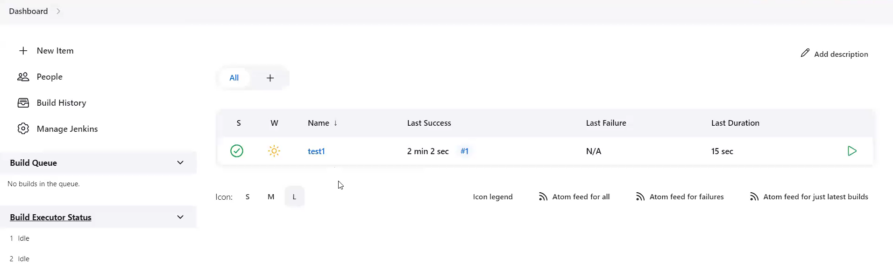

   > **Note**  
   > For more information on installing plugins,
   see [Installing a plugin](https://www.jenkins.io/doc/book/managing/plugins/#installing-a-plugin)

### CDEvents Sink Types

|                                              | Sink Type | Description                                                                                                                                      |
|----------------------------------------------|-----------|--------------------------------------------------------------------------------------------------------------------------------------------------|
| 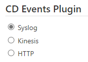   | Syslog    | Use `SysLog` when testing the plugin. The CDEvents will be written to the System Logger to view the events being captured by the plugin.         |
| 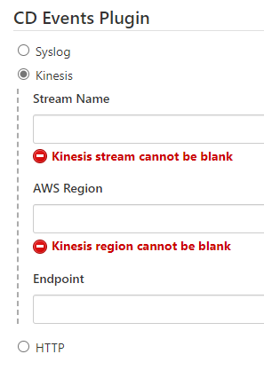 | Kinesis   | Use `Kinesis` to send the CDEvents to an [AWS Kinesis](https://aws.amazon.com/kinesis/) Data Stream to capture, process, and store the CDEvents. |
| 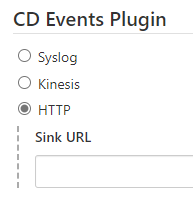       | HTTP      | Use `HTTP` to send the CDEvents to an HTTPEndpoint.                                                                                              |

## Changelog

* For recent versions, see [GitHub Releases](https://github.com/jenkinsci/cdevents-plugin/releases)

## Contributing

See [CONTRIBUTING.md](./CONTRIBUTING.md) for the contribution guidelines.

## License

* Plugin source and documentation - [Apache 2.0](https://opensource.org/license/apache-2-0/)
